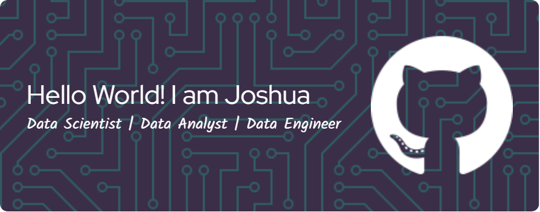

### Hello World! Here with me Joshua Remedial Syeba

### 🌐 Socials:
)  

### 💻 Tech Stack:
           
### 📊 GitHub Stats:
 
 

### 🏆 GitHub Trophies

---

<!-- Proudly created with GPRM ( https://gprm.itsvg.in ) -->