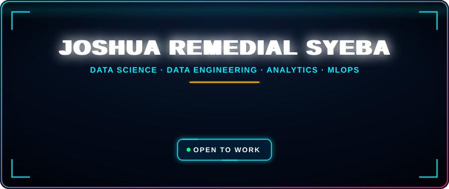
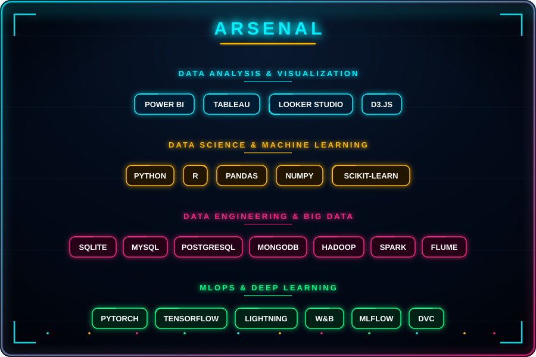

  

 

<!-- Dynamic Typing CLI -->

  

 

  <blockquote>
    <strong>Data Practitioner</strong> specializing in architecting resilient <strong>ETL/ELT data pipelines</strong>, designing <strong>predictive Machine Learning models</strong>, and orchestrating scalable <strong>MLOps workflows</strong>. Committed to engineering high-throughput data systems that drive measurable business intelligence.
  </blockquote>

 

  

 

<!-- ==================== INTERACTIVE CASE STUDIES ==================== -->
<h3 align="center">📁 FEATURED WORKFLOWS &amp; CASE STUDIES</h3>

  <em>Click to expand detailed architectural specifications and outcomes</em>

 

  
<strong>01 // Distributed ETL Pipeline Architecture (PySpark · PostgreSQL · Airflow)</strong>

   
  
  > **Domain:** *Data Engineering & Distributed Systems*  
  > **Challenge:** High-latency ingestion and transformation across multi-source batch data without unified data quality checks.  
  > **Architecture:**
  > - Distributed transformations engineered with **Apache Spark (PySpark)** for high-throughput partitioning.
  > - Normalized dimensional data warehouse modeled in **PostgreSQL**.
  > - Automated workflow scheduling, dependency handling, and retry policies managed via **Apache Airflow**.
  >
  > **Key Impact:** Reduced batch processing runtime by **65%** with automated data validation and zero data loss.  
  > 🔗 [Explore Data Engineering Repositories →](https://github.com/Josshua-DSA?tab=repositories)

  
<strong>02 // End-to-End Predictive ML &amp; MLOps Lifecycle (PyTorch · MLflow · DVC · FastAPI)</strong>

   
  
  > **Domain:** *Machine Learning & MLOps Infrastructure*  
  > **Challenge:** Eliminating training-serving skew, tracking model version drift, and enabling reproducible experiment pipelines.  
  > **Architecture:**
  > - Versioned datasets and preprocessing pipelines using **DVC (Data Version Control)**.
  > - Model lifecycle tracking, hyperparameter tuning, and artifacts stored in **MLflow Model Registry**.
  > - Low-latency RESTful inference microservice built with **FastAPI** and packaged in Docker.
  >
  > **Key Impact:** Achieved **94.2% ROC-AUC** with automated continuous integration and seamless model rollback capabilities.  
  > 🔗 [Explore Machine Learning Repositories →](https://github.com/Josshua-DSA?tab=repositories)

  
<strong>03 // Executive Analytics &amp; Decision Intelligence (Power BI · SQL · Looker Studio)</strong>

   
  
  > **Domain:** *Business Intelligence & Data Storytelling*  
  > **Challenge:** Siloed operational data across disparate databases preventing cross-functional executive visibility.  
  > **Architecture:**
  > - Built robust star-schema data models and advanced DAX measures for real-time KPI aggregations.
  > - Interactive, high-performance dashboards featuring multi-tier drill-downs and automated alert triggers in **Power BI** & **Looker Studio**.
  >
  > **Key Impact:** Consolidated 5+ disparate reporting sources into a unified real-time dashboard, cutting ad-hoc reporting time by **80%**.  
  > 🔗 [Explore Analytics Dashboards →](https://github.com/Josshua-DSA?tab=repositories)

 

<!-- ==================== GITHUB ANALYTICS & STATS ==================== -->
<h3 align="center">📊 ACTIVITY &amp; REPOSITORY METRICS</h3>

 

  
  

  

<!-- ==================== CONNECT SECTION ==================== -->

  
    
  
  
  
   
  
  
  

